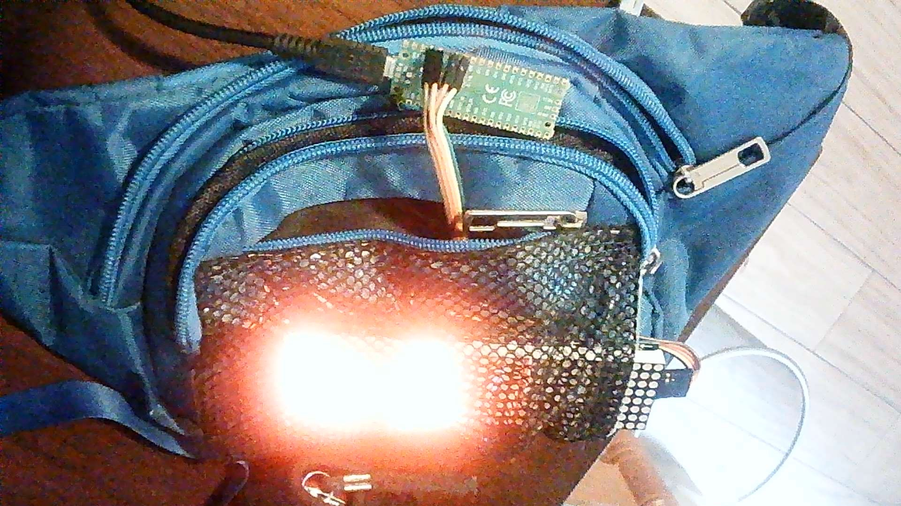

# pico-max7219

The goal of this project is to have an app to customize banners to display in a 8x32 led matrix controlled by a raspberry pi pico and a max7219.

This project consists in 2  main parts:

## micropython interpreter

A micropython app for the raspberry pi pico, which reads a JSON config file and displays text or pixels banners.

## kangurera

A desktop app written in PyQt5, which reads, modifies and writes the banners.

It needs python 3 and PyQt installed locally. A detailed README inside the folder.

# Hardware Components
* Raspberry pi pico (some headeres are needed: 4,5,7,8 and 40)
* Led Matrix Max7219 8 x 32
* 5 Jumper cables

# Instructions

1. Install micropython in the raspberry pi pico [Instructions](https://micropython.org/download/rp2-pico/)
2. Upload the folder using thonny
3. Run kangurera to configure

# Links
Based on [Mike Causer's micropython-max7219](https://github.com/mcauser/micropython-max7219)

License
Licensed under the  [MIT License](http://opensource.org/licenses/MIT)